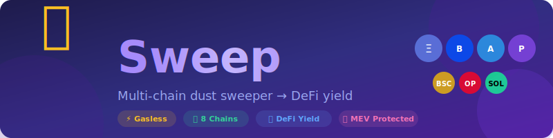

<p align="center">
  
</p>

<p align="center">
  <strong>Multi-chain dust sweeper that consolidates small token balances into DeFi yield positions — without needing native gas tokens.</strong>
</p>

<p align="center">
  <a href="https://github.com/nirholas/sweep/stargazers"></a>
  <a href="https://github.com/nirholas/sweep/blob/main/LICENSE"></a>
  <a href="https://github.com/nirholas/sweep"></a>
</p>

<p align="center">
  <a href="#-quick-start">Quick Start</a> •
  <a href="#-features">Features</a> •
  <a href="docs/">Documentation</a> •
  <a href="#-contributing">Contributing</a>
</p>

---

<p align="center">
  
  
  
  
  
</p>

## 🎯 Problem

Crypto users accumulate "dust" — small token balances worth $0.50-$10 that are economically impractical to move or swap because gas fees exceed the token value.

```
Typical Wallet:
├── Ethereum:  $3 SHIB, $2 PEPE... but $0 ETH for gas ❌
├── Base:      $5 memecoins...     but $0 ETH for gas ❌
├── Arbitrum:  $4 ARB dust...      but $0 ETH for gas ❌
└── Solana:    $8 memecoins...     but $0 SOL for gas ❌

Total trapped value: ~$20+ that user cannot access
```

## ✨ Solution

Sweep consolidates dust across multiple chains, pays gas with tokens you already have, and routes everything into yield-generating DeFi positions.

### Key Features

- **Multi-Chain**: Ethereum, Base, Arbitrum, Polygon, BSC, Linea, Optimism, Solana
- **Gasless**: Pay gas with any ERC-20 token via ERC-4337 account abstraction
- **DeFi Routing**: Deposit directly into Aave, Yearn, Beefy, Lido, Jito
- **Cross-Chain**: Consolidate dust from all chains to one destination
- **MEV Protected**: CoW Protocol batch auctions for better execution

## 📦 Project Structure

```
sweep/
├── contracts/           # Solidity smart contracts (Foundry)
├── src/                 # Backend API (Hono + Node.js)
├── frontend/            # Next.js 14 frontend
├── docs/                # Documentation
└── tests/               # Integration & E2E tests
```

## 🚀 Quick Start

### Prerequisites

- Node.js 20+
- Docker & Docker Compose
- Foundry (`curl -L https://foundry.paradigm.xyz | bash && foundryup`)

### Development Setup

```bash
# Clone the repo
git clone https://github.com/nirholas/sweep.git
cd sweep

# Copy environment variables
cp .env.example .env
# Edit .env with your API keys

# Start infrastructure (Postgres, Redis)
docker-compose up -d

# Install dependencies
npm install

# Run database migrations
npm run db:migrate

# Start development server
npm run dev
```

### Smart Contracts

```bash
cd contracts

# Install dependencies
forge install

# Build
forge build

# Test
forge test

# Deploy (testnet)
forge script script/Deploy.s.sol --rpc-url $RPC_URL --broadcast
```

### Frontend

```bash
cd frontend

# Install dependencies
npm install

# Start dev server
npm run dev
```

## 📚 Documentation

| Document | Description |
|----------|-------------|
| [RESEARCH.md](./RESEARCH.md) | Project vision, competitive analysis, roadmap |
| [docs/SYSTEM_ARCHITECTURE.md](./docs/architecture/SYSTEM_ARCHITECTURE.md) | Technical architecture |
| [docs/API.md](./docs/API.md) | REST API reference |
| [docs/openapi.yaml](./docs/openapi.yaml) | OpenAPI 3.1 specification |
| [docs/CONTRACTS.md](./docs/CONTRACTS.md) | Smart contract documentation |
| [docs/SECURITY.md](./docs/SECURITY.md) | Security policy & best practices |

## 🔐 Security

See [SECURITY.md](./docs/SECURITY.md) for:
- Vulnerability reporting
- Security best practices
- Sensitive file handling

**Never commit:**
- `.env` files with real values
- Private keys or seed phrases
- API keys or secrets

## 🛠️ Tech Stack

| Layer | Technology |
|-------|------------|
| Smart Contracts | Solidity, Foundry, OpenZeppelin |
| Backend | Node.js, Hono, BullMQ, Drizzle ORM |
| Frontend | Next.js 14, wagmi, viem, TailwindCSS |
| Database | PostgreSQL, Redis |
| Hosting | Vercel (frontend), Railway (backend) |
| Account Abstraction | ERC-4337, Pimlico, Coinbase Smart Wallet |
| DEX | 1inch, Jupiter, Li.Fi, CoW Protocol |
| DeFi | Aave V3, Yearn V3, Beefy, Lido, Jito |
| Bridges | Across, Stargate, Hop |

## 🚀 Deploy

See [DEPLOY.md](./DEPLOY.md) for deployment instructions.

**Quick deploy:**
- Frontend → [Vercel](https://vercel.com) (free)
- Backend → [Railway](https://railway.app) (~$15/mo with DB)

## 🤝 Contributing

1. Fork the repository
2. Create a feature branch (`git checkout -b feature/amazing`)
3. Commit your changes (`git commit -m 'Add amazing feature'`)
4. Push to the branch (`git push origin feature/amazing`)
5. Open a Pull Request

## 📄 License

MIT License - see [LICENSE](./LICENSE) for details.

---

Built with 🧹 by the Sweep team